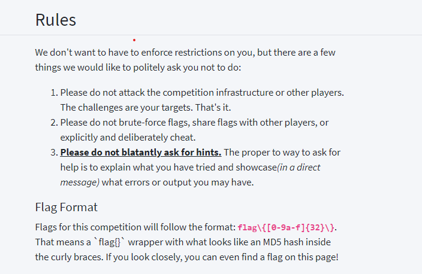
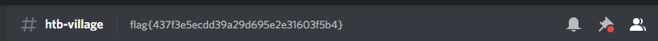
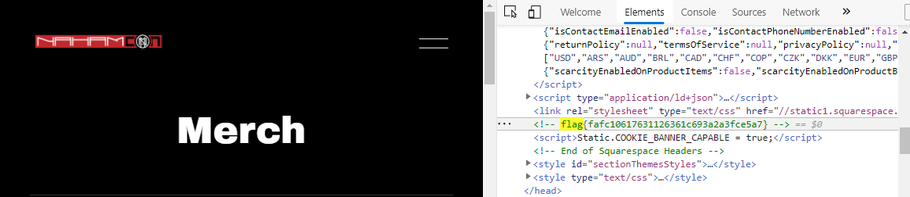
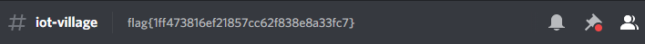
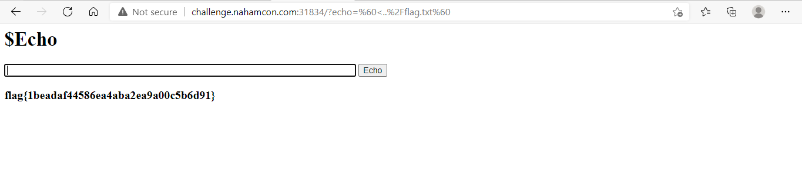

# Nahamcon CTF 2021 Write Up

## 1. Read The Rules
### <b> Problem: </b>
Please follow the rules for this CTF!

Connect here: </br>
[Read The Rules](https://ctf.nahamcon.com/rules)

### <b> Solution: </b>
kunjungi linknya. Kemudian akan terlihat flagnya seperti gambar berikut. </br>



<hr>


## 2. HTB Village
### <b> Problem: </b>
Come join the party at the [HTB Village](https://discord.com/invite/Na9mxe7YGW), and track down a flag!

### <b> Solution: </b>
kunjungi linknya. Kemudian akan terlihat flagnya seperti gambar berikut. </br>



<hr>


## 3. Merch Store
### <b> Problem: </b>
Check out our [Merch Store](https://www.nahamcon.com/merch)! A portion of the proceeds go to support Women in CyberSecurity @WiCySorg!

Perform some online reconnaissance to track down a flag on the merch store!

### <b> Solution: </b>
kunjungi linknya. Inspect element web tersebut. Kemudian cari flagnya. Sehingga flag dapat ditemukan seperti gambar berikut </br>



<hr>

## 4. INE Career Corner
### <b> Problem: </b>
Come join the party at the [INE Career Corner](https://discord.com/invite/Na9mxe7YGW), and track down a flag!

### <b> Solution: </b>
kunjungi linknya. Kemudian akan terlihat flagnya seperti gambar berikut. </br>


<hr>

## 5. IoT Village
### <b> Problem: </b>
Come join the party at the [IoT Village](https://discord.com/invite/Na9mxe7YGW), and track down a flag!

### <b> Solution: </b>
kunjungi linknya. Kemudian akan terlihat flagnya seperti gambar berikut. </br>



<hr>

## 6. Live Recon Village
### <b> Problem: </b>
Come join the party at the [Live Recon Village](https://discord.com/invite/Na9mxe7YGW), and track down a flag!

### <b> Solution: </b>
kunjungi linknya. Kemudian akan terlihat flagnya seperti gambar berikut. </br>


<hr>

## 7. $Echo
### <b> Problem: </b>
So I just made a hardcoded bot that basically tells you what you wanna hear. Now usually it's a $ for each thing you want it to say but I'll waive the fee for you if you beta test it for me.

Press the Start button on the top-right to begin this challenge.
Connect with:</br>
http://challenge.nahamcon.com:31834/

### <b> Solution: </b>
Halaman ini terlihat meneruskan input kita ke perintah yang memfilter beberapa jenis karakter. Jadi kita dapat mengeksekusi sesuatu sebagai contoh menggunakan command berikut.
```
`ls`
```
Kita juga dapat menyimpulkan bahwa hal ini dapat mengarahkan kita ke konten file yang kita mau.</br>

tambahkan 
```
`ls../`
```
 sebagai output ke placeholder yg tersedia. Dengan menuliskan nama flag yg dimau. Dengan mencoba nama filenya sebagai berikut.
 ```
 `<../flag.txt`
 ```



<hr>