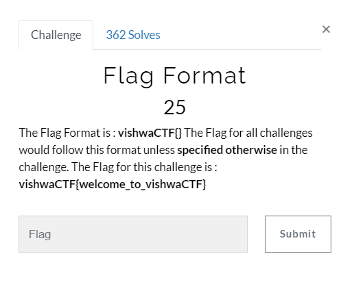

# Vishwa CTF 2021 Write Up

## <b> <i> A. Warm Up </i> </b>
## 1. Flag Format
#### <b> Problem: </b>
The Flag Format is : vishwaCTF{} The Flag for all challenges would follow this format unless specified otherwise in the challenge. The Flag for this challenge is : vishwaCTF{welcome_to_vishwaCTF}

### <b> Solution: </b>
masukkan vishwaCTF{welcome_to_vishwaCTF} yang tertulis di soal  

## <b> <i> B. General </i> </b>
## 1.Treasure Hunt
#### <b> Problem: </b>
Instagram, Twitter and LinkedIn are the steps to Social Success. And, I'm sure I put the flag somewhere on our posts here, but I cant remember if it was the caption or comment or retweet. Can you help me find it? Go sequentially.  
[Instagram](https://www.instagram.com/cybercell_viit/)  
[Linkedin](https://www.linkedin.com/company/cybercell-viit)  
[Twitter](https://twitter.com/cybercellviit?lang=en) 

### <b> Solution: </b>
1. Kunjungi post terawal dari instagram vishwa. 

    
2. Kunjungi post terawal dari linkedin vishwa dan lihat komentarnya  
    
3. Kunjungi tweet vishwa pada tanggal berikut.  
    

